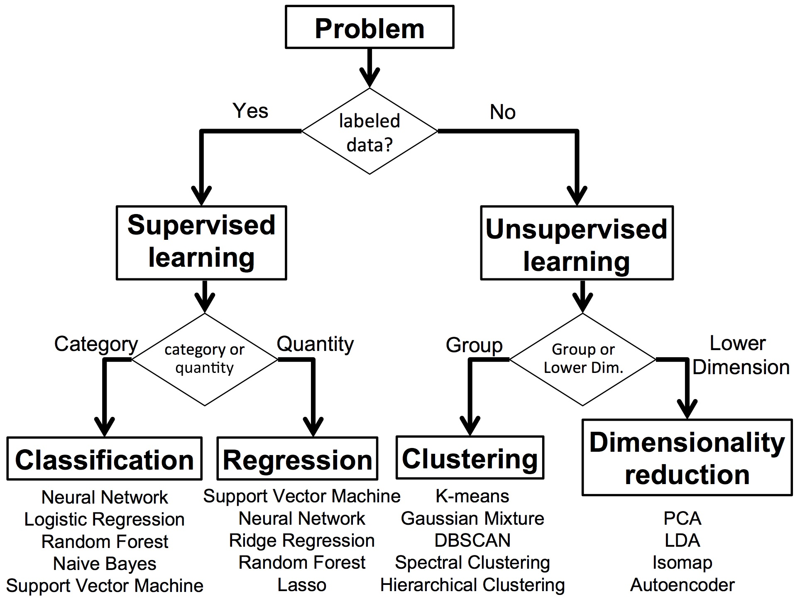

## Heart Disease Prediction Using Machine Learning

This project applies machine learning techniques to predict the presence of heart disease using a real-world dataset sourced from Kaggle. The goal is to support early diagnosis and intervention for at-risk individuals, potentially reducing premature deaths due to cardiovascular disease. Several standard classification models were implemented, alongside a novel hybrid ensemble model using majority voting. The study showed that ensemble models generally outperform individual classifiers in accuracy and recall. Emphasis was placed on data quality, pre-processing, feature engineering, and model evaluation using clinically relevant metrics.

Tasks completed:

* Performed data pre-processing: checked for null values, duplicate rows, outliers and class imbalance. Removed non-sensical observations
* Performed exploratory data analysis (EDA): used descriptive statistics, feature correlations and distributions
* Transformed categorical variables into numeric using encoding via the pd.get_dummies() function
* Scaled numerical features using StandardScaler
* Trained the following models: K-Nearest Neighbours (KNN), Logistic Regression, Decision Tree using GridSearchCV for hyperparameter tuning with cross-validation.
* Developed a Majority Voting Ensemble model
* Evaluated model performance using metrics such as accuracy, recall and confusion matrices

  
  

### 📄 License

This project is licensed under the [MIT License](LICENSE).  
© 2025 Junaid Din. **Use of this project requires attribution in accordance with the license terms.**
